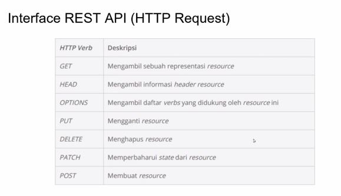

## Synchronous

setiap proses berjalan secara berurutan

## Asynchronous

kita butuh mekanisme asynchronous
-doesnt happents at the same time

## Single thread dan Multithread

Javacript is single thread -> semua eksekusinya secara default adalah synchronous

1 thread -> anggapla 1 proses

gambaran single thread

### dengan metode asynchronous

kita biat membuat sebuah proses berjalan secara multithread padahal tidak

### callback function

adalah sebuah function yang akan kita passing kedalam sebuah argumen, dan argumen inila yang akan dieksekusi oleh function

## promise

fulfilled dan rejected harus kita handle dan buat secara bersamaan

# API

API adalah singkatan dari Application Programming Interface, yaitu perangkat lunak yang **menjembatani** dua aplikasi untuk berbicara satu sama lain.

- Monolith
  web - DB
  jika terjadi masalah di server, web sama sekali tidak bisa diakses

- microservice

web - API - DB
client side - API - Server Side

dimana antara web dan API yang dikirim data berupa json
sedangkan API dan DB adalah raw data

WEB akan meminta data (get) ke API kemudian pada API terjadi query data dan logic prosess

- API dapat digunakan untuk beberapa basis web, sistem operasi, sistem basis data, dan perangkat keras komputer

## API Web Base

- Web API
  software penyedia layanan. fungsi spesifik yang dapat digunakan untuk software lain.

- Web service
  penyedia layanan seperti web API tapi ada aturan teikat layanan yang dapat diakses

- REST API (Represetationa State Transfer)
  penyedia layanan namun bekerja seperti prinsip web yang meimiliki protokol

### REST API

- berdasarkan pada resource dan addressnya (addressability)
- penggunaan interface yang seragam
- representasi resource dan tipe media
  penggunaan: xml, json(menyimpan data dalam bentuk object)

#### Interface REST API (HTTP Request)

### Fetch Data

Treatments Data <--Http request (cth: get)-- Display
Treatments Data --Http response (json)--> Display

tools :

- postman
- insomnia
